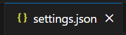

# 河北工业大学本科毕业设计论文/说明书模板
首次上线日期：2024/3/31

## 关于为什么使用LaTeX而不是Word
已决定使用的同学可略过本节。
### 使用LaTeX的优势：

使用此LaTeX模板撰写毕业论文，不必关注那些繁琐的格式调整（因为模板已经自动帮你调整好了），而可以直接聚焦于你写作的内容，极大地提高写作效率（虽然**前期**学习曲线有亿点陡峭）。

当然，Word也是一个优秀的文字处理软件，用它来书写毕业论文没有问题。然而，许多同学对Word的掌握很浅显，如果你不太懂自动生成目录、项目编号、文档内链接、公式编辑器、表格边框格式调整、页眉页脚、分节分页、对不同节设置不同页码格式、用合适方式排列图文……这些繁琐的格式设置会占用大量时间，因此**综合长远来看，你对Word排版的学习成本并不低于LaTeX**。

### 附LaTeX的优点N条：

专业排版质量: LaTeX能够提供接近出版物级别的排版质量，尤其是在数学公式、表格、参考文献等方面的处理上远超Word。

稳定性和兼容性: LaTeX文档的编译过程确保了文档的稳定性和一致性，不受不同版本或不同操作系统的影响。

自动化功能: LaTeX可以自动进行编号（如图表、公式）、生成目录、索引和参考文献列表，这些在长文档处理中尤为重要。

模板使用: 多数学术机构、期刊和会议提供LaTeX模板，这些模板符合他们的格式要求，使用LaTeX可以直接应用这些模板，省去了调整格式的麻烦。

协作和版本控制: LaTeX文件是文本文件，适合使用版本控制系统（如Git）进行管理，便于多人协作和历史更改记录。

学术界普及度高: 在学术界，尤其是数学、物理、计算机科学等领域，LaTeX是写作标准，学习和使用LaTeX有助于融入这些学术圈子。对于准备攻读研究生的同学更是一项必须掌握的技能。


## 获取方式

下载至本地：
* [GitHub Releases](https://github.com/LiuPeng-NGP/HEBUT-Thesis/releases)
下载其中最新发行版的zip包(Windows)或tar.gz包(macOS/Linux)即可。

在线编辑：
* [Overleaf 模板](https://www.overleaf.com/read/tcthxvcxhdhz#239939)
使用前需要一个邮箱来注册Overleaf账号。Overleaf Templete公开正在平台审查流程中，
目前可通过左上角 Menu -> Copy Project 使用。


## 系统需求
如果需要在本地编辑，则需要以下环境依赖，如果采用Overleaf线上编辑，则可跳过此节。

### Windows
首先安装Tex Live，可以使用“Tex Live + 某一编辑器 + 扩展”的方式，如使用**TeX Live +  VScode + LaTex Workshop**。具体方法可参考网络视频教程。

#### 一个面向108k纯小白的仅供参考的配置方案：


仅需三步：

1、安装Tex Live

2、在Tex Live下载的间隙安装vscode及所需插件

3、写一个测试例子进行验证

##### 1、安装Tex Live

可按照以下视频中的操作方式安装Tex Live，具体在6分32秒-10分30秒之间。6分32秒前是介绍，可略过。

仅供参考非广告：https://www.bilibili.com/video/BV1y8411P7qs/?spm_id_from=333.337.search-card.all.click

视频中的TeX Live网址：https://www.tug.org/texlive/

在cmd命令行可以看到Tex的版本后，即表明安装完成。

##### 2、在Tex Live漫长的下载过程中安VScode及所需插件

可按照以下视频中的操作方式安装VScode，具体在0分0秒-2分0秒之间。后面是配置python插件的部分可略过。

仅供参考非广告：https://www.bilibili.com/video/BV1bK411P767/?spm_id_from=333.337.search-card.all.click&vd_source=0ef7bb5863a1513a4c6bf7f839da5f48

VScode网址：https://code.visualstudio.com/

配置到中文界面后，点击左侧扩展


搜索“LaTeX Workshop”和"Markdown All in One"，并安装。完成后页面如下：


##### 3、Tex Live、VScode、插件均安装完成后的实例测试

在上栏点击“文件”-“打开文件夹”（若已打开文件请关闭文件夹），选择解压后的“HEBUT-Thesis-某一版本号”文件夹，比如“HEBUT-Thesis-1.0.0”，打开后双击HebutThesis_example.tex文件。

配置json文件：
点击F1键（有些笔记本电脑需要fn+F1），搜索“首选项：打开用户设置（JSON）”，双击打开以下文件：


在大括号**内部**插入以下内容：
```
    "latex-workshop.latex.tools": [
        {
            "name": "latexmk",
            "command": "latexmk",
            "args": [
                "-xelatex",
                "-synctex=1",
                "-interaction=nonstopmode",
                "-file-line-error",
                "%DOC%"
            ]
        },

        {
            "name": "latexmk",
            "command": "latexmk",
            "args": [
                "-synctex=1",
                "-interaction=nonstopmode",
                "-file-line-error",
                "-pdf",
                "-outdir=%OUTDIR%",
                "%DOC%"
            ],
            "env": {}
        },
        {
            "name": "lualatexmk",
            "command": "latexmk",
            "args": [
                "-synctex=1",
                "-interaction=nonstopmode",
                "-file-line-error",
                "-lualatex",
                "-outdir=%OUTDIR%",
                "%DOC%"
            ],
            "env": {}
        },
        {
            "name": "xelatexmk",
            "command": "latexmk",
            "args": [
                "-synctex=1",
                "-interaction=nonstopmode",
                "-file-line-error",
                "-xelatex",
                "-outdir=%OUTDIR%",
                "%DOC%"
            ],
            "env": {}
        },
        {
            "name": "latexmk_rconly",
            "command": "latexmk",
            "args": [
                "%DOC%"
            ],
            "env": {}
        },
        {
            "name": "pdflatex",
            "command": "pdflatex",
            "args": [
                "-synctex=1",
                "-interaction=nonstopmode",
                "-file-line-error",
                "%DOC%"
            ],
            "env": {}
        },
        {
            "name": "bibtex",
            "command": "bibtex",
            "args": [
                "%DOCFILE%"
            ],
            "env": {}
        },
        {
            "name": "rnw2tex",
            "command": "Rscript",
            "args": [
                "-e",
                "knitr::opts_knit$set(concordance = TRUE); knitr::knit('%DOCFILE_EXT%')"
            ],
            "env": {}
        },
        {
            "name": "jnw2tex",
            "command": "julia",
            "args": [
                "-e",
                "using Weave; weave(\"%DOC_EXT%\", doctype=\"tex\")"
            ],
            "env": {}
        },
        {
            "name": "jnw2texminted",
            "command": "julia",
            "args": [
                "-e",
                "using Weave; weave(\"%DOC_EXT%\", doctype=\"texminted\")"
            ],
            "env": {}
        },
        {
            "name": "pnw2tex",
            "command": "pweave",
            "args": [
                "-f",
                "tex",
                "%DOC_EXT%"
            ],
            "env": {}
        },
        {
            "name": "pnw2texminted",
            "command": "pweave",
            "args": [
                "-f",
                "texminted",
                "%DOC_EXT%"
            ],
            "env": {}
        },
        {
            "name": "tectonic",
            "command": "tectonic",
            "args": [
                "--synctex",
                "--keep-logs",
                "%DOC%.tex"
            ],
            "env": {}
        }
    ],
    //原来的
    "files.autoSave": "onFocusChange",
    "editor.fontSize": 16,
    "window.systemColorTheme": "dark",
    "security.workspace.trust.untrustedFiles": "open"

```
按下Ctrl+S保存文件

点击HebutThesis_example.tex文件，点击右上角绿色按键


运行时效果如下：


运行完成后，如果0错误，即表明配置成功（因不同软硬件环境差异可能会有警告，属于正常现象）。

### MacOS
安装MacTex，编辑器可以用MacTex自带的TeXshop。

传送门：https://www.tug.org/mactex/

### Linux
    
暂无测试


## 使用说明

配置好环境依赖并下载完成模板文件后，打开此项目，包含以下使用中需要改动的文件/文件夹：

* HebutThesis_example.tex：主.tex文件，构成文章的框架，
调用了document文件夹中的所有tex文件、figures文件夹中所有图片以及各类包，
其本身的内容也是一份模板使用手册

* document：所有被主.tex文件调用的文件所在的文件夹，形成了文章的各个部分。

* figures：所有插图所在的文件夹，在.tex文件中被调用。

* bibliography.bib：所有引用的参考文献所在的文件。

注意：撰写文章时仅需手动改动以上文件、文件夹，其余文件均不需要手动改动。

每次撰写完成时，可先保存文件，然后编译运行HebutThesis_example.tex，
即可生成HebutThesis_example.pdf，即为最终的PDF文件。

## 常见问题


* 先到[GitHub Discussions](https://github.com/LiuPeng-NGP/HEBUT-Thesis/discussions)搜索已有讨论，如果没有则提出新的问题
* 如果仍有疑问，可加QQ群：917157946


